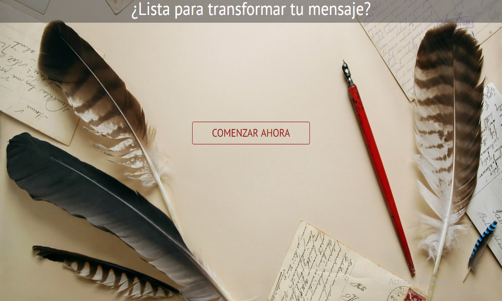
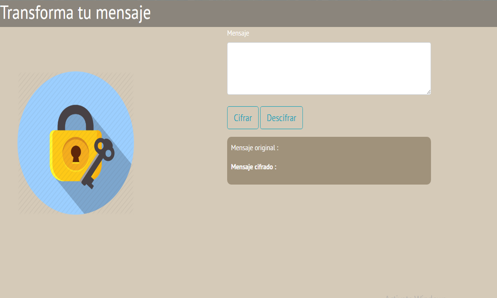
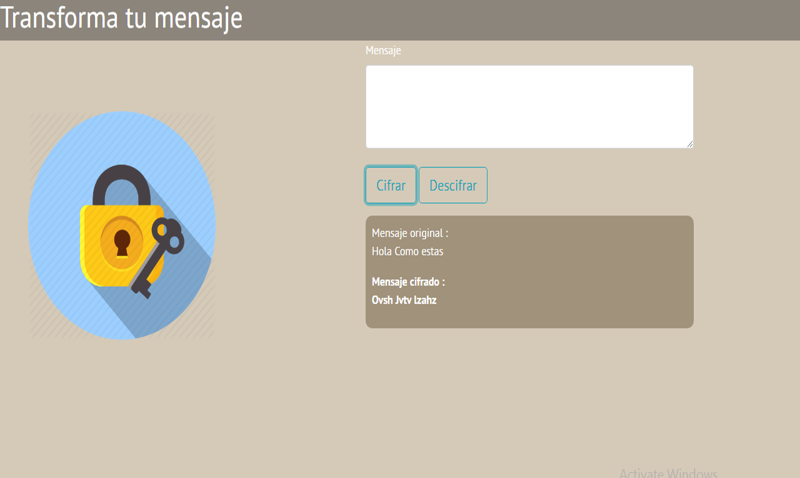
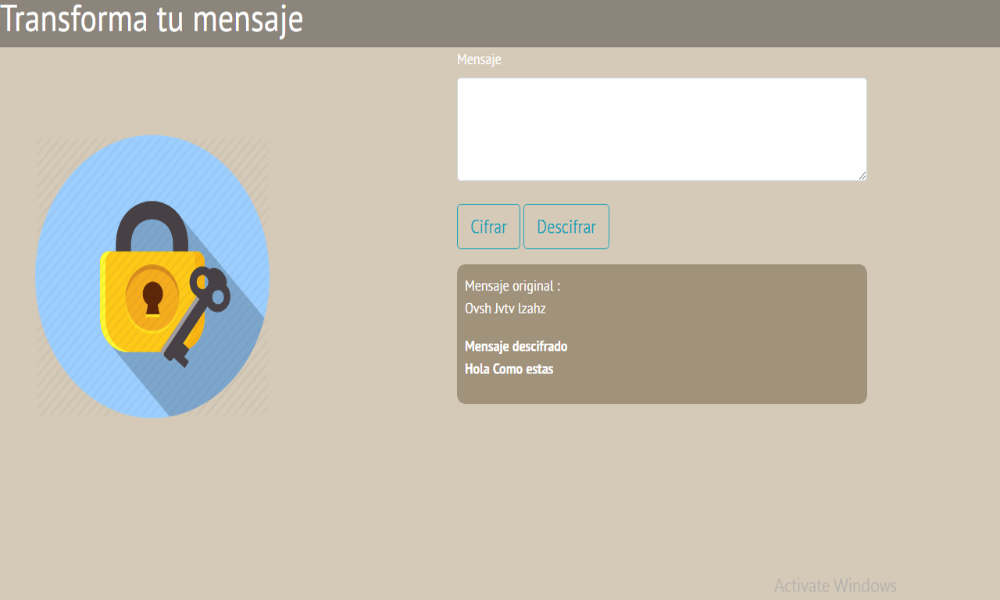
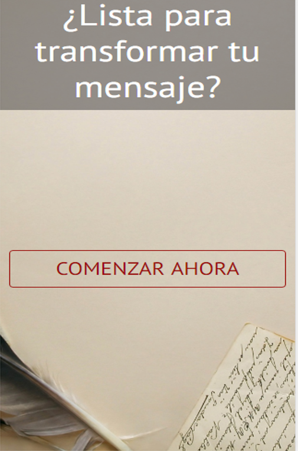
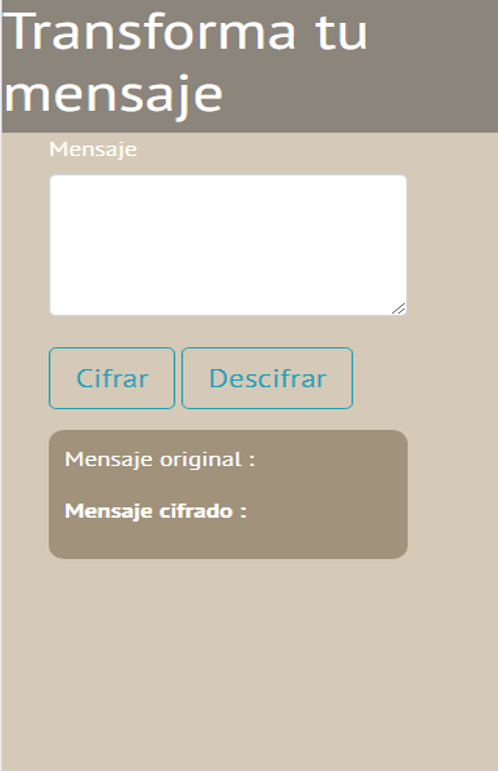

# RETO N° 1 : "Cifrado Cesar ES6"

* **Track:** _Specialization_
* **Curso:** _JS DEEP DIVE: CREA TU PROPIA LIBRERÍA USANDO JAVASCRIPT_
* **Unidad:** _Fundamentos de javascript_

***
## Descripción del proyecto:

El reto consiste en pasar el codigo del ejercicio "Cifrado Cesar" a ECMA SCRIPT 6 .

## Flujo de la aplicacion :

* Vista desktop :
Vista de inicio:

* Segunda vista : Se cifran y descifran los mensajes(recibe texto),la función recibe espacios en blanco y no se ejecuta hasta que se ingrese un texto;

* Cifrando mensajes :

* Descifrando mensajes:

* Vistas mobile:

***
## Lenguajes utilizados :

~~~
HTML
~~~
~~~
CSS
~~~
~~~
ECMA SCRIPT 6
~~~    
***
## FRAMEWORKS :

~~~
Bootstrap
~~~
~~~
JQuery
~~~    
***
